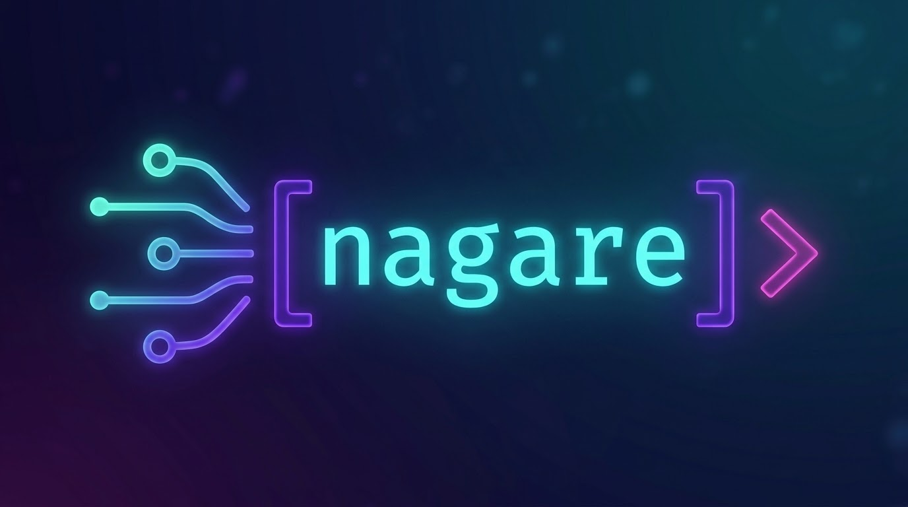

<h1 align="center">nagare-go 流れ</h1>
<p align="center">A tmux-integrated session manager for AI coding agents.<br>Monitor, switch, and control multiple Claude Code, Codex, OpenCode, Gemini CLI, Crush, pi, and OhMyPi sessions from a single interface.</p>

<p align="center">
  
</p>

Go rewrite of [nagare](https://github.com/nmicovic/nagare) — single binary, 3ms startup, no runtime dependencies.

## Features

- **Session Picker** — fuzzy search, list/grid views, live tmux preview
- **Real-time Status** — hooks, plugins, and extensions detect agent state (idle/working/waiting/dead)
- **Worktree Aware** — panes in different git worktrees of one repo show their own path, branch, and name
- **Worktree Launch** — `-w my-feature` or F3 starts an agent in a fresh named worktree, grouped under its repo
- **Notifications** — toast, bell, OS notifications, popup when agents need attention
- **Session Creation** — create new tmux sessions with agents (Ctrl+n, Ctrl+r, CLI)
- **Inline Prompting** — send prompts to agents without leaving the picker (Ctrl+l, Ctrl+g)
- **Inter-Agent Messaging** — MCP server lets agents discover, message, and coordinate with each other (pi has no MCP client, so it gets the same tools through a CLI bridge; OhMyPi uses native MCP)
- **Ticket Board** — a local cross-project kanban for today's work, with durable tickets, agent delegation, and human review
- **6 Themes** — tokyonight, catppuccin, dracula, gruvbox, monokai, nord
- **3ms Startup** — compiled Go binary, no runtime dependencies

## Install

```bash
git clone https://github.com/nemke/nagare-go
cd nagare-go
./compile.bash
```

## Setup

```bash
# One command installs everything:
./nagare-go setup
```

This does three things:

1. **Installs status reporting** so each agent notifies nagare on every event (prompt, stop, permission, session start/end). Each agent gets whatever mechanism it supports:

   | Agent | Mechanism |
   |-------|-----------|
   | Claude Code | hooks in `~/.claude/settings.json` |
   | Codex | hooks in `~/.codex/hooks.json` |
   | Gemini CLI | hooks in `~/.gemini/settings.json` |
   | OpenCode | plugin at `~/.config/opencode/plugins/nagare.js` |
   | pi | extension at `~/.pi/agent/extensions/nagare.ts` |
   | OhMyPi (`omp`) | extension at `~/.omp/agent/extensions/nagare.ts` |
2. **Registers the MCP server** in `~/.claude.json`, `~/.codex/config.toml`, `~/.gemini/settings.json`, `~/.config/opencode/opencode.json`, `~/.config/crush/crush.json`, and `~/.omp/agent/mcp.json` — enabling inter-agent messaging and ticket handoff. pi has no MCP client by design, so its extension registers the same tools and routes them through `nagare-go tool`.

3. **Installs messaging workflows** as slash commands (`/nagare-ls`, `/nagare-send`, `/nagare-send-wait`, `/nagare-inbox`) for Claude Code, Gemini CLI, OpenCode, pi, and OhMyPi — and as Agent Skills for Codex and Crush.

Re-running `setup` is safe: it rewrites generated plugin and extension files in place and refreshes every registration.

Codex asks you to review newly installed command hooks once. Open `/hooks` in Codex
and trust the Nagare hooks after setup.

Then add a tmux keybinding to open the picker:

```bash
# Add to ~/.tmux.conf (prefix + g to open picker)
bind g display-popup -w100% -h100% -B -E "/path/to/nagare-go"
```

Reload tmux config: `tmux source-file ~/.tmux.conf`

## Usage

```bash
nagare-go              # open session picker (default)
nagare-go new ~/proj   # create new session with Claude (-a codex|opencode|gemini|crush|pi|omp)
nagare-go new ~/proj -w my-feature   # start an agent in a new named git worktree
nagare-go new myproto  # quick prototype (creates in ~/Prototypes/)
nagare-go board        # cross-project ticket board and agent delegation
nagare-go notifs       # notification center + settings
nagare-go setup        # install status reporting + MCP server + slash commands
nagare-go mcp          # run MCP server (stdio, used by agent CLIs)
```

## Board Keybindings

| Key | Action |
|-----|--------|
| `h/l` or arrows | Move between columns |
| `j/k` or arrows | Select a ticket |
| `[` / `]` | Move ticket left / right |
| `n` | Create ticket |
| `e` | Edit ticket |
| `d` | Delegate to an available idle agent |
| `a` | Show available agents |
| Enter | Jump to the assigned agent |
| `t` | Toggle Today / All |
| Tab / Shift+Tab | Cycle list / board / grid forward or backward |
| `q` / Esc | Quit |

## Picker Keybindings

| Key | Action |
|-----|--------|
| Type | Fuzzy search |
| Enter | Jump to session |
| Esc | Quit |
| Tab / Shift+Tab | Cycle list / board / grid forward or backward |
| Ctrl+y/a | Approve permission |
| Ctrl+f | Star session |
| Ctrl+o | Cycle sort |
| Ctrl+w | Unload agent |
| Ctrl+x | Kill session |
| F2 | Name the selected task |
| F5 | Session note |
| Ctrl+n | New session |
| Ctrl+r | Quick prototype |
| Ctrl+l | Inline prompt |
| Ctrl+g | Editor prompt |
| Ctrl+e | Edit config |
| Ctrl+t | Theme picker |
| F1 | Help |

## Configuration

`~/.config/nagare/config.toml`

```toml
[notifications]
enabled = true

[notifications.needs_input]
toast = true
bell = true
os_notify = true
popup = false

[notifications.task_complete]
toast = true
min_working_seconds = 30

[picker]
show_help_bar = true

[appearance]
theme = "tokyonight"
```

## Architecture

Single Go binary with cobra subcommands. All code in `internal/` packages.

Built with [Bubble Tea](https://github.com/charmbracelet/bubbletea) (TUI), [Lip Gloss](https://github.com/charmbracelet/lipgloss) (styling), and [Cobra](https://github.com/spf13/cobra) (CLI).

Compatible with the Python nagare version — same state files, same JSON schemas, same hook format.

## License

MIT
